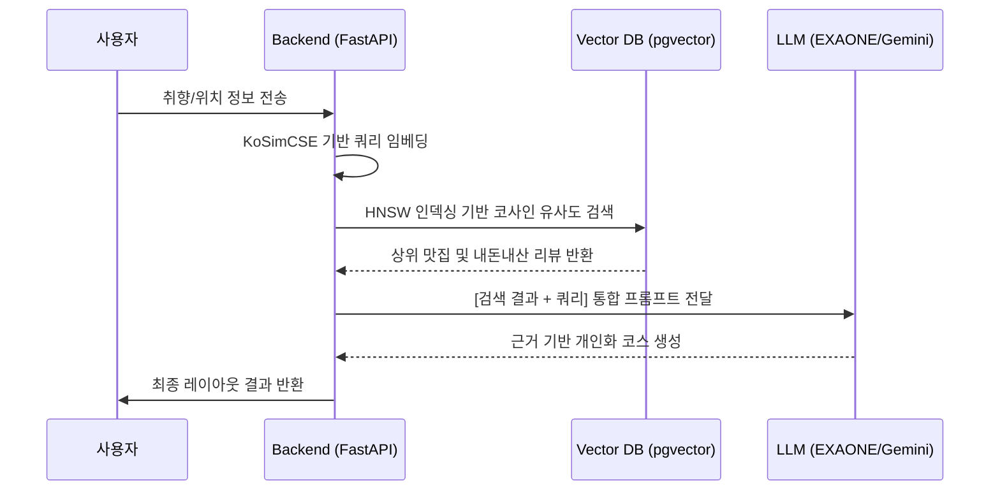

# 🛠️ RAG(Retrieval-Augmented Generation) 파이프라인 심층 기술 명세

본 문서는 제안된 위치 기반 관광 추천 시스템의 핵심인 RAG 파이프라인의 기술적 구현 상세를 설명합니다. 이 내용은 논문의 시스템 상세 설계 섹션에 활용하기 적합합니다.

---

## 1. 데이터 전처리 및 지식 생성 (Ingestion Phase)

### 1.1 유기적 데이터 필터링 (Organic Review Filtering)
- **과정**: Scrapy 프레임워크를 이용해 수집된 블로그 본문 데이터를 전처리.
- **필터링 로직**: "내돈내산", "영수증 인증", "광고 아님" 등 실사용자의 경험을 입증하는 키워드 가중치를 부여.
- **결과**: 홍보성 블로그를 배제하고 실질적인 맛집의 장단점이 포함된 유기적 리뷰(Organic Review) 데이터셋 구축.

### 1.2 문장 임베딩 (Encoding)
- **임베딩 엔진**: `KoSimCSE-roberta-multitask` (768 Dimensions)
- **특징**: 단순 키워드 매칭이 아닌, 한국어 문장 간의 깊은 문맥적 의미를 보존하여 사용자의 복합적인 요구사항(예: "아이와 함께 가기 좋은 아늑한 곳")을 벡터 공간에 정확히 투영.
- **데이터 구조**: 식당 기본정보와 정제된 블로그 리뷰를 결합하여 고차원 벡터로 변환 후 저장.

---

## 2. 벡터 검색 엔진 (Retrieval Phase)

### 2.1 인덱싱 알고리즘 (HNSW Indexing)
- **기술 스택**: Supabase(PostgreSQL) 기반 `pgvector` 확장 모듈.
- **알고리즘**: 대규모 고차원 벡터 데이터셋에서도 실시간 검색 성능을 보장하기 위해 **HNSW (Hierarchical Navigable Small World)** 인덱스 구축.
- **효과**: 위치 기반 실시간 서비스에서 발생할 수 있는 데이터 조회 레이턴시를 최소화하여 실시간성에 대한 논문 피드백 보완.

### 2.2 하이브리드 검색 전략 (Hybrid Retrieval)
1.  **메타데이터 필터링**: 사용자의 현재 위치 및 이동수단을 고려한 지리적 반경(Radius) 필터링 우선 수행.
2.  **벡터 유사도 계산**: 인코딩된 사용자 쿼리 벡터와 DB 내 식당/리뷰 벡터 간의 **코사인 유사도(Cosine Similarity)** 계산.
3.  **Top-K 인출**: 유사도가 가장 높은 상위 K개의 장소와 그에 부합하는 블로그 리뷰 컨텍스트를 동적으로 추출.

---

## 3. 컨텍스트 보강 및 답변 생성 (Augmentation & Generation)

### 3.1 동적 프롬프트 구성 (Prompt Augmentation)
추출된 데이터는 LLM에 최적화된 형태로 재구성되어 입력으로 전달됩니다.

```text
[System Instruction]
당신은 현지인 수준의 관광 전문가입니다. 제공된 '맛집 정보'와 '필터링된 블로그 리뷰'만을 근거로 삼아, 사용자의 특성에 최적화된 추천 코스를 생성하세요.

[Context]
- 식당 A: 순천역 근처, 평점 4.7, 대표메뉴: 꼬막정식
- 리뷰 요약: "자극적이지 않아 아이와 먹기 좋음", "주차 공간이 넓어 편리함" (Organic Review)

[User Query]
- 연령: 30대, 동합: 가족, 동반인원: 4명, 이동수단: 자차
```

### 3.2 생성 통제 (Grounded Response)
- **기법**: 모델 내부의 일반적인 지식이 아닌, 제공된 컨텍스트(순천 지역 실시간 데이터)에 기반해서만 답변하도록 하는 **Grounded Generation** 수행.
- **결과**: 맛집의 영업 유무, 현장 분위기 등에 대한 환각(Hallucination) 현상을 방지하고 추천의 신뢰성을 확보.

---

## 4. 파이프라인 시퀀스 다이어그램


