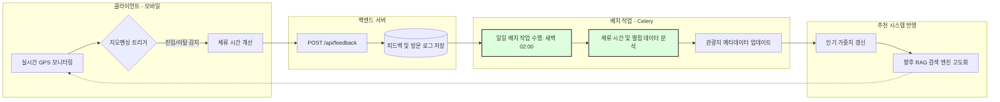

# 길이음(GilIEum) 시스템 다이어그램 명세서

심사위원의 기술적 상세 설명 요구에 대응하기 위해, 논문에 삽입하기 적합한 형태의 다이어그램 코드(Mermaid)를 제공합니다. 아래 코드를 Mermaid를 지원하는 에디터(Notion, GitHub, Mermaid Live Editor 등)에 복사하여 사용하세요.

---

## 1. RAG 기반 여행 코스 추천 흐름도 (RAG Pipeline Flow)

이 다이어그램은 사용자 입력부터 최종 코스 생성까지의 시맨틱 검색 엔진 흐름을 보여줍니다.

---

## 2. 지속적 학습 피드백 루프 (Continuous Learning Loop)

이 다이어그램은 실시간 지오펜싱 데이터를 통해 시스템이 어떻게 자가 학습(Re-learning)하고 최적화되는지를 보여줍니다.

---

## 3. 논문 활용 팁 (Paper Tips)

- **Fig 1. RAG 파이프라인 아키텍처**: 첫 번째 다이어그램은 논문의 "3장. 제안하는 시스템" 섹션에 넣어 RAG의 구체적인 작동 방식을 설명할 때 사용하세요.
- **Fig 2. 지속적 학습 피드백 루프**: 두 번째 다이어그램은 "3.3절. 피드백 기반 재학습 구조" 섹션에 넣어 심사위원이 지적한 기술적 상세 설명을 보완하는 데 활용하세요.
- **용어 사용**: 논문에서는 '재학습'이라는 말 대신 **"사용자 피드백 기반 동적 가중치 최적화 구조"** 또는 **"지오펜싱 체류 시간 기반 온라인 학습"**이라는 용어를 쓰시면 훨씬 전문적으로 보입니다.
