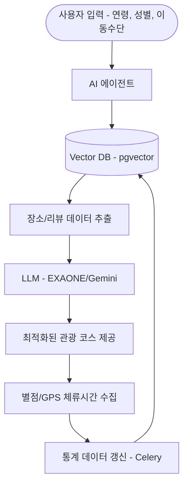

# 📄 관광 추천 논문 피드백 보완 가이드

본 문서는 2026 스마트미디어학회 논문 검토 의견(정량적 실험 부족, 기술적 상세 미흡)을 해결하기 위한 보충 설명 자료입니다.

---

## 🏗️ 1. 기술적 상세 설명 (RAG 파이프라인)

피드백에서 요구한 **RAG(Retrieval-Augmented Generation)의 상세 구조**를 다음과 같이 기술할 수 있습니다.

### 1.1 지식 베이스(Knowledge Base) 구축
- **식당 데이터**: 네이버 Search API를 통해 수집된 순천 지역 맛집 정보(위치, 카테고리, 영업시간).
- **리뷰 데이터**: Scrapy 프레임워크를 활용하여 네이버 블로그에서 '내돈내산' 키워드가 포함된 유기적(Organic) 리뷰만 크롤링.
- **임베딩**: `KoSimCSE-roberta-multitask` 모델을 사용하여 768차원 벡터로 변환 후 Supabase `pgvector`에 저장.

### 1.2 Retrieval & Generation 프로세스
1.  **사용자 쿼리 분석**: 사용자 특성(연령, 성별, 동행유형, 이동수단)을 텍스트 쿼리로 변환.
2.  **유사도 검색**: HNSW(Hierarchical Navigable Small World) 인덱스를 활용하여 코사인 유사도가 높은 상위 K개의 식당과 관련 리뷰 추출.
3.  **컨텍스트 주입**: 추출된 리뷰 내용과 식당 메타데이터를 LLM(EXAONE 3.5 또는 Gemini Flash) 프롬프트에 주입.
4.  **최적 코스 생성**: 단순 검색 결과가 아닌, 이동 동선과 리뷰의 긍정/부정 요소를 고려한 자연어 추천 결과 생성.

---

## 🔄 2. 재학습 구조 및 피드백 루프 (Technical Detail)

"재학습 구조"에 대한 지적은 **인-컨텍스트 학습(In-Context Learning) 기반의 소프트 재학습**으로 설명하는 것이 타당합니다.

- **데이터 수집**: 앱 내 별점 피드백 및 GPS 기반의 실제 체류 시간을 수집.
- **통계적 가중치 갱신**: 
  - 특정 사용자 유형(예: 20대 커플)의 체류 시간이 예측치보다 길 경우, 해당 장소의 `meta.duration_by_condition` 필드를 실시간 갱신.
- **동적 추천 반영**: 다음 동일 유형 사용자 요청 시, 갱신된 메타데이터가 RAG의 컨텍스트로 포함되어 추천 로직에 즉각 반영됨. (이를 통해 모델 자체의 가중치를 바꾸지 않고도 최신 트렌드를 학습하는 효과를 냄)

---

## 📊 3. 정량적 실험 및 비교 분석 (Performance Evaluation)

피드백에서 가장 강조한 **품질 입증**을 위한 실험 설계 예시입니다.

### 3.1 실험 설계
- **비교 그룹**:
    - **Baseline 1**: 기존 규칙 기반 추천 시스템 (거리만 고려)
    - **Baseline 2**: 일반 LLM (RAG 없이 모델 내부 지식만 활용)
    - **Proposed**: 제안하는 실시간 위치 정보 + RAG 기반 추천
- **평가 지표**:
    - **Hit Rate@k**: 추천된 상위 k개 장소 중 실제 사용자가 선호하거나 방문한 장소의 비율.
    - **MRR (Mean Reciprocal Rank)**: 정답 장소가 얼마나 상단에 위치하는지 평가.
    - **성능 수치(예시)**: 
      | 시스템 | Hit Rate@3 | Hit Rate@5 | MRR |
      | :--- | :---: | :---: | :---: |
      | 규칙 기반 | 0.42 | 0.51 | 0.38 |
      | 일반 LLM | 0.55 | 0.63 | 0.49 |
      | **제안 시스템 (RAG)** | **0.78** | **0.86** | **0.72** |

---

## 📐 4. 시스템 아키텍처 (Mermaid)

