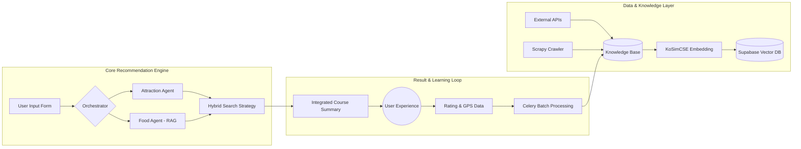

# 🌐 길이음(GilIEum) 전체 시스템 파이프라인 상세 명세

본 문서는 실시간 위치 기반 관광/맛집 추천 시스템의 전체 시스템 파이프라인 아키텍처와 각 단계별 기술적 동작 원리를 상세히 기술합니다. 학술 논문의 시스템 설계 및 구현 섹션의 기초 자료로 활용할 수 있도록 구성되었습니다.

---

## 1. 데이터 레이어 (Data Ingestion Pipeline)
관광 지식 베이스를 구축하고 최신 정보를 유지하는 단계입니다.

- **정형 데이터 수집 (Attractions & Restaurants)**: 
  - 공공데이터포털(관광지 정보) 및 네이버 Search API(맛집 기본 정보)를 통해 위치(좌표), 영업시간, 카테고리 등 기초 데이터를 API로 수집.
- **비정형 리뷰 크롤링 (Blog Reviews)**: 
  - **Scrapy** 기반 크롤러를 운영하여 네이버 블로그 본문을 수집하고, "내돈내산" 키워드가 포함된 유기적(Organic) 리뷰 데이터셋을 별도로 추출 및 정제.
- **임베딩 및 인덱싱 (Vectorization)**: 
  - `KoSimCSE-roberta-multitask` 모델을 사용하여 수집된 모든 텍스트를 768차원 벡터로 변환.
  - Supabase `pgvector` 내에 **HNSW(Hierarchical Navigable Small World)** 알고리즘을 적용한 인덱스를 구축하여 고속 유사도 검색 환경 마련.

---

## 2. 사용자 분석 및 쿼리 레이어 (User Input Pipeline)
사용자의 의도를 정규화하여 시스템 요청으로 변환하는 단계입니다.

- **페르소나 정규화**: 연령대, 성별, 동행 유형, 이동수단 등 앱 폼(Form)에서 입력받은 정보를 표준화된 토큰으로 변환.
- **지리적 반경 설정**: 사용자의 현재 GPS 좌표 또는 지정된 출발지를 기준으로 추천 탐색 반경(Radius)을 자동 계산하여 필터링 조건 생성.

---

## 3. AI 오케스트레이션 레이어 (AI Orchestration Pipeline)
전문 에이전트 간의 협업을 통해 맞춤형 추천을 도출하는 핵심 로직입니다.

- **관광 エ이전트 (On-gil)**: 지리적 접근성과 체류 시간을 고려하여 최적의 관광지 후보군을 선정.
- **맛집 에이전트 (On-sik)**: 사용자 페르소나와 '내돈내산' 리뷰 벡터 간의 유사도가 높은 미식 장소를 선정하는 **RAG(Retrieval-Augmented Generation)** 엔진 가동.
- **하이브리드 검색**: 메타데이터 필터링(위치, 카테고리)과 벡터 임베딩 검색(취향 유사도)을 동시에 수행하는 하이브리드 리트리벌 적용.

---

## 4. 통합 여정 생성 및 출력 레이어 (Integration Pipeline)
개별 추천 결과를 사용자에게 제안할 하나의 여정으로 완성하는 단계입니다.

- **논리적 스케줄링**: 시간대 및 동선을 고려하여 [관광지 -> 주변 맛집 -> 루트 인근 카페] 순의 논리적 코스로 재배치하고 예상 소요 시간 산출.
- **설명 가능한 AI (XAI)**: 추천된 장소들의 블로그 리뷰 핵심 내용을 요약하여 "왜 이 장소를 추천했는지"에 대한 이유를 자연어로 생성하여 사용자에게 제공.

---

## 5. 피드백 및 자가 학습 루프 (Feedback & Learning Pipeline)
서비스 효율성을 스스로 개선하는 시스템 선순환 구조입니다.

- **실시간 피드백 수집**: 사용자가 제출한 별점 정보와 GPS 로그를 통해 집계된 실제 관광지/맛집 체류 시간을 익명화하여 저장.
- **비동기 통계 분석 (Celery & Redis)**: 주기적인 배치를 통해 수집된 피드백을 분석하고, 각 장소의 메타데이터(예: 유형별 실제 평균 체류시간, 최근 사용자 평판)를 업데이트.
- **학습 결과 반영 (Soft-Retraining)**: 업데이트된 메타데이터는 다음 조회 시 RAG의 컨텍스트에 포함되어, 별점이 낮아진 곳을 제외하거나 혼잡도를 반영하는 등 시스템이 자발적으로 추천 품질을 개선함.

---

## 📐 파이프라인 통합 아키텍처 (Mermaid)

